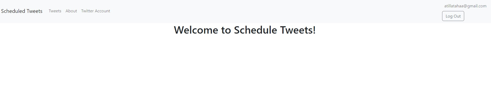
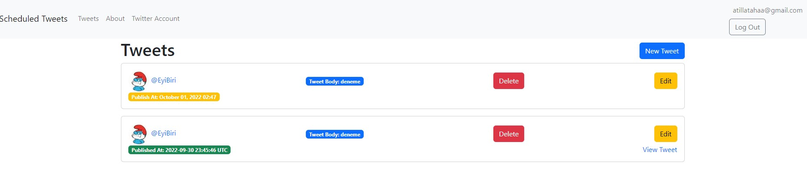
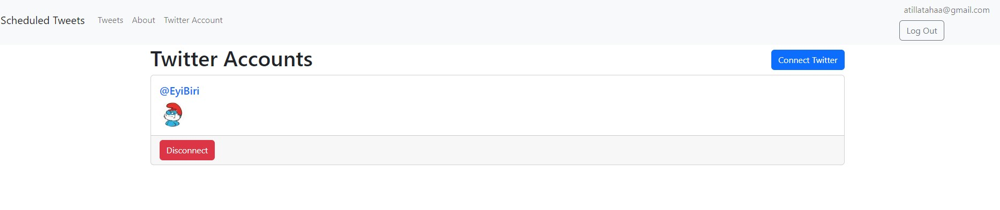
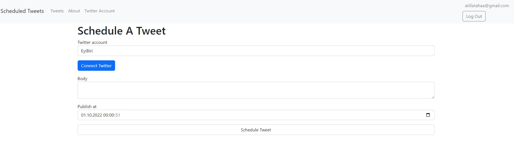

<!-- Please update value in the {}  -->

<h1 align="center">{Schedule Tweets}</h1>

<div align="center">
   You can schedule tweets with this application also you can control a lot of Twitter accounts. This application uses background jobs this causing this application to perform 
</div>

<div align="center">
  <h3>
    <a href="/">
      Coming Soon
    </a>
    <span> | </span>
    <a href="https://github.com/AtillaTahak/scheduled_tweets">
      Github
    </a>
    <span> | </span>      
    </a>
  </h3>
</div>

<!-- TABLE OF CONTENTS -->

## Table of Contents

- [Overview](#overview)
  - [Built With](#built-with)
- [Features](#features)
- [How to use](#how-to-use)
- [Contact](#contact)
- [Acknowledgements](#acknowledgements)

<!-- OVERVIEW -->

## Overview








### Built With

<!-- This section should list any major frameworks that you built your project using. Here are a few examples.-->

- [Css](https://tr.wikipedia.org/wiki/CSS)
- [Html](https://www.w3.org)
- [Ruby ](https://www.ruby-lang.org/en/) 
- [Ruby on Rails]
- [Redis]
- [Sidekiq]
- [Twitter]
- [sqlite]
- [omniauth-twitter]

## Features

- You can easly schedule tweet and control 
- You can create user
- You can changed password
- if you forget password application have forget password features
- You can add multiply account for twitter
- You can add multiply tweet and you can schedule
- You can edit tweets and delete


## How To Use

<!-- Example: -->

To clone and run this application, you'll need [Git](https://git-scm.com) and [Ruby ](https://www.ruby-lang.org/en/) (which comes with [bundle]), [Redis] installed on your computer. From your command line:

```bash
# Clone this repository
$ git clone https://github.com/AtillaTahak/scheduled_tweets

# Install dependencies
$ bundle install

# Start Redis for background jobs
$ redis-server

#Start sidekiq
$ bundle exec sidekiq

# Run the app
$ rails s
```

## Acknowledgements

<!-- This section should list any articles or add-ons/plugins that helps you to complete the project. This is optional but it will help you in the future. For example -->

- [Gorails](https://gorails.com)

## Contact

- GitHub: [@AtillaTahak](https://github.com/AtillaTahak)
- Twitter: [@AtillaTahaa](https://twitter.com/AtillaTahaa)
- LinkedIn: [LinkedIn](https://www.linkedin.com/in/atilla-taha-kördüğüm-a93702186/)
- Blog: [Blog](atillataha.blogspot.com)
- Youtube: [YouTube](https://www.youtube.com/channel/UCmoD0x4Z9vdG2PCsI5p8FYg)
- Portfolio: [Portfolio](https://atillataha.netlify.app)
